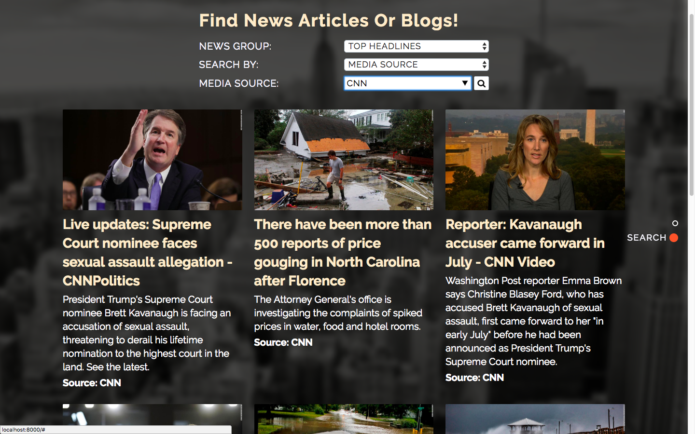
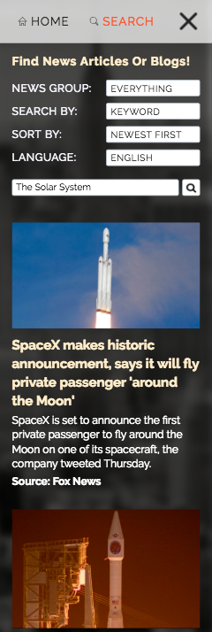

# NEWS DIGEST APP

## LINK TO THE APP: 
[https://ispoljari.github.io/news-digest-app/](https://ispoljari.github.io/news-digest-app/)

## SUMMARY:
With this app the user can search through millions of articles from various news sources and blogs, and filter them by selecting different categories. 

The articles are presented with an image, a title, a subtitle and the name of the news source it originates from.

The user can then click on the article and will be redirected to the coresponding web page that contains the full article.

---

Live articles and blogs are pulled from the News API asynchronously using jQuery's AJAX requests.

The News API ([https://newsapi.org/docs/get-started](https://newsapi.org/docs/get-started)) is a simple HTTP REST API for searching and retrieving live articles from all over the web.

---

The user can filter the search results by ajdusting the following search parameters;

* **News Group**: Top Headlines / Everything
* **Search By**: Media Source/Country/Category/Keyword
* **Additional Filtering By**: Language/Date

Articles from the **"Top Headlines"** news group are retrieved from the */v2/top-headlines* endpoint.

Articles from the **"Everything"** news group are retrieved from the */v2/everything* endpoint. 

The /v2/sources endpoint is used to retrieve a list of the most notable sources (cca. 150) which are offered to the user via a drop down datalist in the Search By: "Media Source" category.

**A developer key is used for accessing the API endpoints. It is restricted to 250 calls every 6 hours. If you cannot retrieve any articles after trying out several search parameter combinations, or after reloading the web page, it is probable that the 6-hour limit has been reached. Please try using the app again after a few hours.**

---

## SCREENSHOTS (DESKTOP):

Start screen before the animation: 

Start screen after the animation:

Search screen with results (darker for better color contrast):

---

## SCREENSHOTS (MOBILE):

Start screen after the animation: 

Search screen with results:

---

## TECHNOLOGIES USED:
HTML/CSS/JavaScript/jQuery/News API

